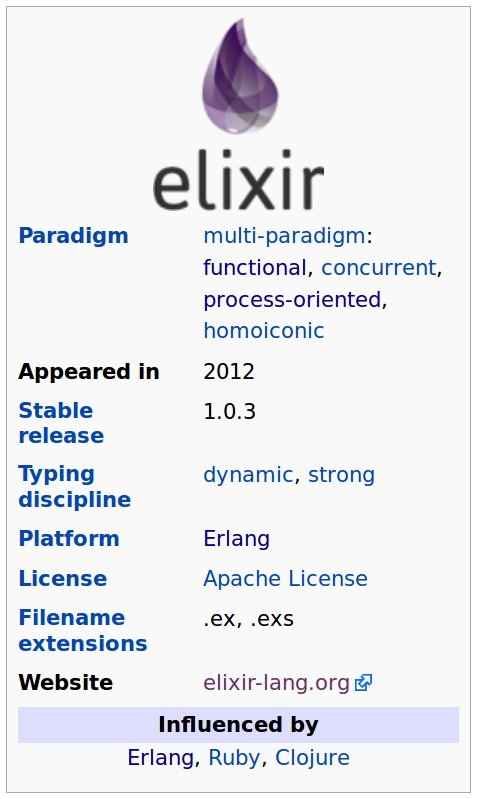

# 
\centering
\begin{Huge}
Hamburg-BEAMers
\end{Huge}


\centering
\begin{Huge}
Meetup \#2
\end{Huge}


# Organisational stuff

\centering
\Large

> * Language: `English || German`
> * Naming: `clone Vienna-BEAMers`
> * Intervall: `0 19 11-17 */2 1 /bin/meetup`
> * Communication: `Meetup.com || Twitter`
> * Website: _Maybe with Elixir/Phoenix?_
> * Locations
> * Contribute
> * Whats your intention?


# 

\centering
\Huge

What is


?

# Wikipedia: Elixir

\centering
\Large

> Elixir is a functional, concurrent, general-purpose programming language that runs on the Erlang Virtual Machine (BEAM). Elixir builds on top of Erlang to provide distributed, fault-tolerant, soft real-time, non-stop applications but also extends it to support metaprogramming with macros and polymorphism via protocols.

# Wikipedia Elixir

\centering




# Example Elixir Code

`hellomodule.exs`
```ruby
defmodule HelloModule do
  def hello(name \\ "World") do
    IO.puts "Hello " <> String.capitalize name
  end
end

HelloModule.hello
#=> "Hello World"

HelloModule.hello "julius"
#=> "Hello Julius"
```


# Example Elixir Code

`fib.exs`
```ruby
defmodule Fib do
  def fib(0), do: 0
  def fib(1), do: 1
  def fib(n) do fib(n-1) + fib(n-2) end
end
 
IO.puts Fib.fib(10) 
#>= 55
```


# 

\centering
\Huge

Show us your

\#myelixirstatus!
